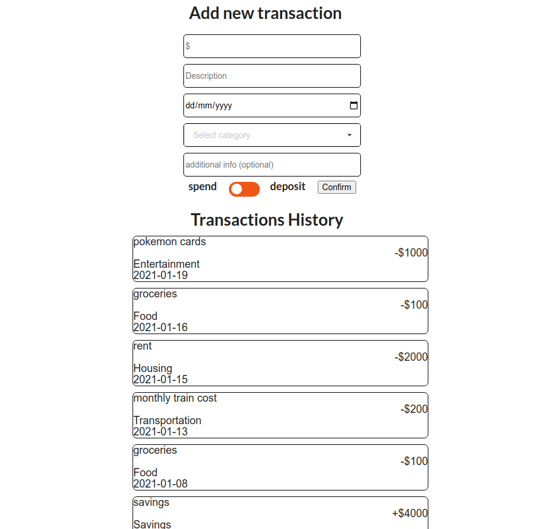
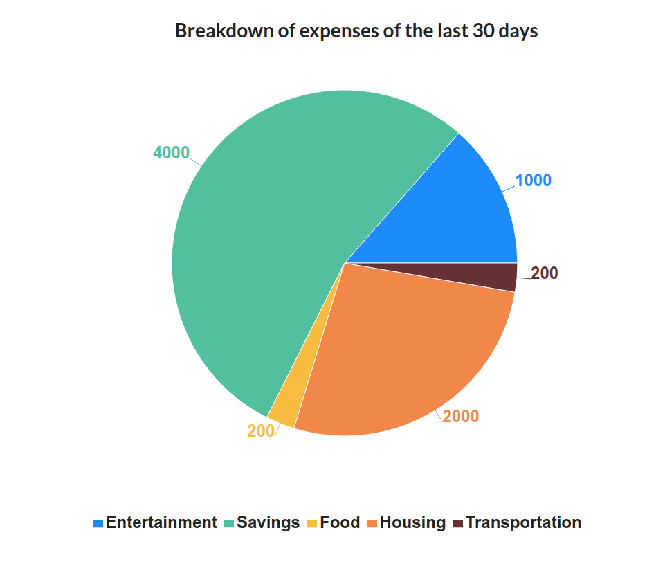

# Budget-mate: Finance management made easy

1. SUMMARY

Budget-mate is a comprehensive financial tracker/budgeting application, with an account feature that allows unique users to track their spending through analytics and set trackable savings goals. 

The main goal of this project is to create an all-in-one personal finance platform. 

2. DEVELOPMENT

Budget-mate is a full-stack application written in Javascript. It was built with the ReactJS library for the front-end, expressJS for the server, and PostgreSQL for the database.

The application is structured as follows:
- Main dashboard/homepage, displays general information via components. (WIP)
- transactions page, to add/remove transactions and review transaction history.
- monthly breakdown page, displays last 30 days spending as a pie chart.
- spending performance page, displayed on a graph for better visual display of spending/saving over time. (WIP)
- savings tracking page, allows the user to create and monitor savings goals.(WIP)
- profile page/settings, displays and allows editing of user's information and settings. (WIP)
- log in page.
- sign up page.

A database is created using PostgreSQL to store user data as well as the financial data entered, and requests are made with SQL commands. For security reasons, the passwords are encrypted using BCrypt.

Deploying this project has proven to be more complicated than expected, and I am currently still working through it.

2. WORK IN PROGRESS/FUTURE WORKS

A fair number of components are Works in Progress (as labelled above).

The aesthetics, look and feel are also in progress.

This project is planned to be deployed on AWS, with the database being replaced with dynamodb.

3. LESSONS LEARNED

React is a great tool to segment a large project into multiple smaller components, allowing the ability to use them when/where needed. 

Deploying a relatively complex full-stack react application is definitely a challenge. I attempted with heroku (unsuccessfully), but will be shifting to AWS as a learning experience. 

