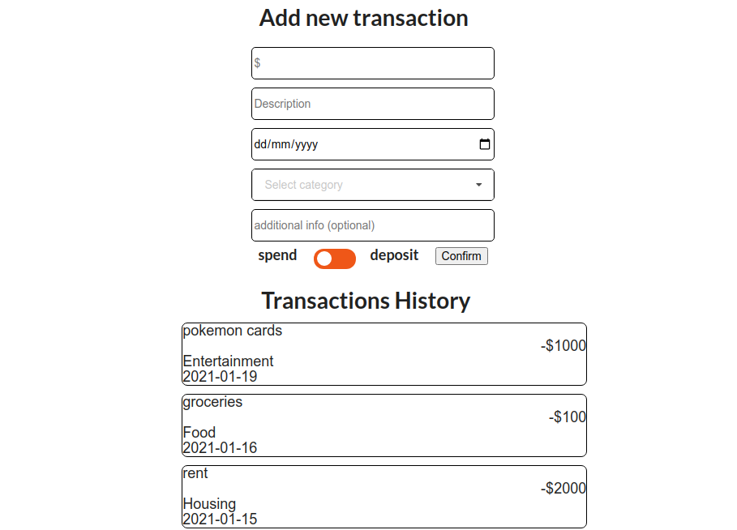

# Budget-mate: Finance management made easy

parts needed:
- landing/homepage/dashboard
- login/signup feature w/ authentication
- graphs, pie charts on ReactJS (import)
- database system to keep track of individuals' finances

# pages total:
- dashboard
- transactions adding/review
- spending performance page
- monthly breakdown page
- profile page/settings
- log in page
- sign up page
- savings tracking page

# components on dashboard
- last 5 transactions overview
- spending performance graph overview
- monthly breakdown pie chart overview
- profile name and image mini banner
- savings tracking metrics overview
- navbar on left of page
